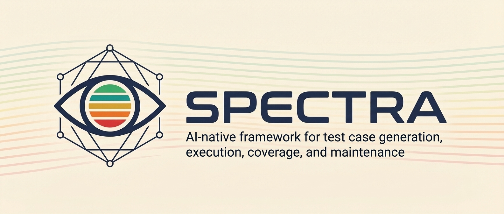

<!-- Banner -->
<p align="center">
  
</p>

<!-- Badges -->
<p align="center">
  <a href="https://www.nuget.org/packages/Spectra.CLI"></a>
  <a href="https://www.nuget.org/packages/Spectra.MCP"></a>
  <a href="https://github.com/AutomateThePlanet/Spectra/actions/workflows/ci.yml"></a>
  <a href="LICENSE"></a>
  <a href="https://dotnet.microsoft.com/download"></a>
</p>

<!-- Tagline -->
<p align="center">
  <strong>AI-native test generation and execution framework.</strong><br>
  From documentation to deterministic test execution.
</p>

---

## Why SPECTRA?

SPECTRA reads your product documentation, generates comprehensive test suites, and executes them through a deterministic AI-orchestrated protocol. It doesn't replace your existing tools — it adds an AI layer.

- **Reads your documentation** — Point SPECTRA at your product docs and it generates comprehensive test suites automatically.

- **AI with guardrails** — Dual-model grounding verification catches hallucinated test steps before they reach your suite.

- **Tests as Markdown** — Test cases are plain Markdown files with YAML frontmatter. They live in GitHub, versioned alongside your code.

- **Deterministic execution** — An MCP-based execution engine provides a state machine that any AI orchestrator can drive without holding state.

- **Coverage visibility** — Three-dimensional coverage analysis: documentation, requirements, and automation. Visual dashboard included.

- **No migration needed** — Integrates with Azure DevOps, Jira, Teams, Slack through their MCP servers. No data sync. No vendor lock-in.

## Key Features

### AI Test Generation

Generate test cases from product documentation through an iterative session.
The AI analyzes your docs, identifies testable behaviors, generates structured test cases, suggests additional tests for uncovered areas, and lets you describe undocumented behaviors — all in one continuous flow.

```bash
spectra ai generate                    # Interactive session
spectra ai generate checkout           # Direct mode
spectra ai generate checkout --auto-complete --output-format json  # CI mode
```

### Grounding Verification

Every generated test is verified by a second AI model against the source documentation.
Hallucinated steps are caught and rejected automatically.

### Coverage Analysis

Three coverage dimensions tracked automatically:
- **Documentation** — which docs have linked tests
- **Requirements** — which requirements are tested
- **Automation** — which tests have automation code

```bash
spectra ai analyze --coverage --auto-link
```

### Visual Dashboard

Static HTML dashboard with suite browser, test viewer, run history, and coverage visualizations.
Deploy to Cloudflare Pages with GitHub OAuth authentication.

```bash
spectra dashboard --output ./site
```

### MCP Execution Engine

Execute tests through Copilot Chat, Claude, or any MCP client.
State machine with pause/resume, crash recovery, and three report formats (JSON, Markdown, HTML).
Inline documentation lookup via Copilot Spaces — testers get answers about test steps without leaving the execution flow.

### Copilot Chat Integration

Bundled SKILL files let you use SPECTRA through natural language in Copilot Chat.
Say "generate test cases for checkout" and the SKILL handles CLI invocation, JSON parsing, and result presentation.

```bash
spectra init                  # Creates 10 SKILLs + 2 agent prompts
spectra update-skills         # Update SKILLs when CLI is upgraded
```

### Generation Profiles

Customize AI output with natural language profiles — detail level, negative scenario count, domain rules, formatting preferences.

## Quick Start

**Prerequisites:** [.NET 8.0+](https://dotnet.microsoft.com/download)

```bash
# Install
dotnet tool install -g Spectra.CLI

# Initialize (creates config, dirs, SKILL files, agent prompts)
spectra init

# Build the document index (also extracts requirements automatically)
spectra docs index

# Generate tests — interactive session with analysis, suggestions, and more
spectra ai generate

# Or direct mode for a specific suite
spectra ai generate checkout --count 10

# Validate generated tests
spectra validate

# Analyze coverage
spectra ai analyze --coverage

# Generate a visual dashboard
spectra dashboard --output ./site
```

**For CI/SKILL workflows** — all commands support `--output-format json` and `--no-interaction`:

```bash
spectra ai generate checkout --auto-complete --output-format json
spectra ai analyze --coverage --output-format json
spectra validate --output-format json --no-interaction
```

See [Getting Started](docs/getting-started.md) for auth setup and detailed instructions.

## Architecture

```
docs/                        <- Source documentation
  |
docs/_index.md               <- Pre-built document index (incremental)
  |
AI Test Generation CLI       <- GitHub Copilot SDK (sole AI runtime)
  |                            Supports: github-models, azure-openai,
tests/                       <-          azure-anthropic, openai, anthropic
  |
MCP Execution Engine         <- Deterministic state machine
  |
LLM Orchestrator             <- Copilot Chat, Claude, any MCP client
  | (as needed)
Azure DevOps / Jira / Teams  <- Bug logging, notifications via their MCPs
```

| Subsystem | Purpose | Independent? |
|-----------|---------|:------------:|
| **AI CLI** | Generate, update, and analyze test cases from documentation | Yes |
| **MCP Engine** | Execute tests through deterministic AI-orchestrated protocol | Yes |

## Ecosystem

SPECTRA is part of the [Automate The Planet](https://www.automatetheplanet.com/) ecosystem:

| Tool | Purpose |
|------|---------|
| [BELLATRIX](https://bellatrix.solutions) | Test automation framework |
| [Testimize](https://github.com/AutomateThePlanet/Testimize) | Test case optimization (hybrid ABC algorithm) |
| **SPECTRA** | AI test generation and execution protocol |

**BELLATRIX** automates test execution. **Testimize** optimizes test case selection. **SPECTRA** generates and maintains the test cases themselves — closing the loop between documentation and quality assurance.

## Documentation

| Guide | Description |
|-------|-------------|
| [Getting Started](docs/getting-started.md) | Install, prerequisites, auth setup, first run |
| [CLI Reference](docs/cli-reference.md) | All commands, flags, and options |
| [Configuration](docs/configuration.md) | Full `spectra.config.json` reference |
| [Test Format](docs/test-format.md) | Markdown format, YAML frontmatter, metadata schema |
| [Coverage Analysis](docs/coverage.md) | Documentation, Requirements, and Automation coverage |
| [Generation Profiles](docs/generation-profiles.md) | Customize AI output style and quality |
| [Grounding Verification](docs/grounding-verification.md) | Dual-model critic for hallucination detection |
| [Document Index](docs/document-index.md) | Pre-built doc index for efficient generation |
| [Skills Integration](docs/skills-integration.md) | Copilot Chat SKILLs and agent prompts |
| [Execution Agent](docs/execution-agent/overview.md) | MCP tools and AI-driven test execution |
| [Architecture](docs/architecture/overview.md) | System design and key decisions |
| [Development Guide](docs/DEVELOPMENT.md) | Building, testing, and running locally |

## Project Status

SPECTRA is in active development.

- **Phase 1: AI Test Generation CLI** ✓
- **Phase 2: MCP Execution Engine** ✓
- **Phase 3: Dashboard & Coverage Analysis** ✓
- **Phase 4: Test Generation Profiles** ✓
- **Phase 5: Grounding Verification** ✓
- **Phase 6: Integrations and Ecosystem** ← *current*

## Contributing

Contributions are welcome! See [CONTRIBUTING.md](CONTRIBUTING.md) for build instructions, code style guidelines, and the PR process.

## License

MIT License. See [LICENSE](LICENSE) for details.
